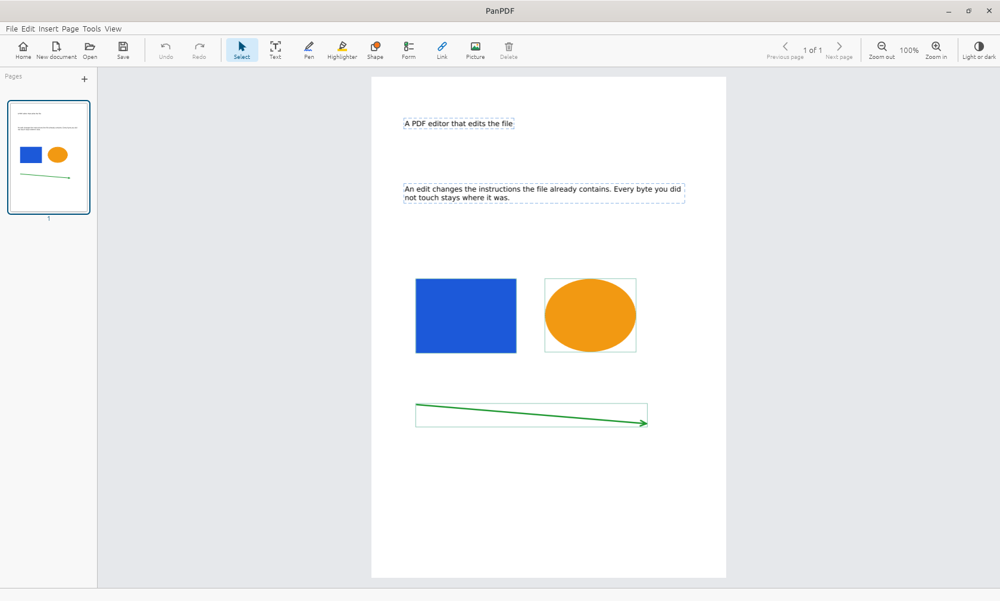

<div align="center">


# PanPDF

**A PDF editor that edits the file.**

Your document keeps its own state: the same objects, the same fonts,
the same protection, the same bytes everywhere you did not touch.

*In development · Linux, Windows and macOS · AGPL-3.0*

</div>



## Why

Most editors that let you change a PDF rebuild the page in a model of their own
and write a new document out of it. Everything you did not touch is rewritten
along with what you did, and what the file used to be is gone.

PanPDF changes the instructions the file already contains. An edit is a change
to those instructions, and every other byte stays where it was.

## What it does

- **Leaves the rest of the file alone.** An edit touches what you edited. The
  objects, the fonts, the metadata and the structure you did not ask about come
  out the other side unchanged.
- **Edits text where it sits** -- retype a line and the paragraph reflows, with
  the document's own fonts, sizes, colours and spacing kept.
- **Types in a font the document carries**, and embeds a new one when it has to,
  so the words you add look like the words already there.
- **Complex scripts are first class** -- the shaping, the marks above and below
  the line, and the places a line may break are the document's own, whatever
  alphabet it is written in. These are what most editors break first.
- **Pictures and drawings** go in, move, scale, turn and come out again, and
  text flows around them.
- **Draws on the page** -- pen, shapes, highlighter, stamps, links, redaction.
- **Manages pages** by dragging -- reorder, rotate, delete, insert, extract.
- **Fills in forms**, and keeps the form working afterwards.
- **Reads scanned pages** so their words can be searched and copied.
- **Opens protected documents** and saves them back still protected, and checks
  a document's signatures.
- **Prints** through the system's own printing.
- **Answers questions about the document you have open**, against a model on
  your own machine or a key you give it -- and sends nothing anywhere until you
  switch it on.
- **Says what it cannot do, by name.** An edit it cannot make exactly is
  refused with a reason, never approximated quietly.

## Download

| Architecture | Windows | Linux | macOS |
| --- | --- | --- | --- |
| **x86-64 (64-bit)** | [ZIP](../../releases/latest) | [DEB](../../releases/latest) · [RPM](../../releases/latest) · [AppImage](../../releases/latest) · [tar.gz](../../releases/latest) | [DMG](../../releases/latest) |
| **ARM64 (Apple Silicon)** | — | — | [DMG](../../releases/latest) |

Every release has [a page of its own](../../releases/latest) with the same
table, the direct links, and the checksums to check them against.

Nothing has to be installed beside it: the Windows build uses only the
libraries Windows ships, and the Linux packages ask for what your desktop
already has.

## Build it yourself

Rust stable 1.97 or later. Nothing is linked at build time that is not in this
repository.

```sh
python3 fonts/vendor.py                 # the faces it draws a missing font from
cargo build --release -p pdf-desktop
./target/release/pdf-app document.pdf
```

To make the installable packages instead:

```sh
packaging/build.sh --list               # what this machine can make
packaging/build.sh                      # everything it can, into dist/
```

`./verify.sh` is the gate: formatting, clippy, the tests inside the crates, and
the browser target. It stops at the first failure.

On a minimal Debian or Ubuntu install add `libgl1`, `libxkbcommon-x11-0` and
`libwayland-client0`; the window opens them when it runs, not when it builds.
Optional: `tesseract-ocr` to read scanned pages, `zenity` for the system file
dialog, `curl` for the assistant.

## Status

**In development.** It runs, it opens and edits real documents, and it is not
finished. Releases are previews, with no promise that today's behaviour is
tomorrow's. Try it, and say what broke.

## Contributing

[`CONTRIBUTING.md`](CONTRIBUTING.md), and security reports go to
[`SECURITY.md`](SECURITY.md). How the crates fit together is in
[`ARCHITECTURE.md`](ARCHITECTURE.md), which is also where the code's
explanation lives: the source itself carries no comments by design.

## Licence

GNU Affero General Public License, version 3 -- [`LICENSE`](LICENSE). If you
run a modified version for other people to use over a network, the AGPL asks
you to offer them its source.

The font files `fonts/vendor.py` fetches carry their own licences, recorded in
[`fonts/README.md`](fonts/README.md).
